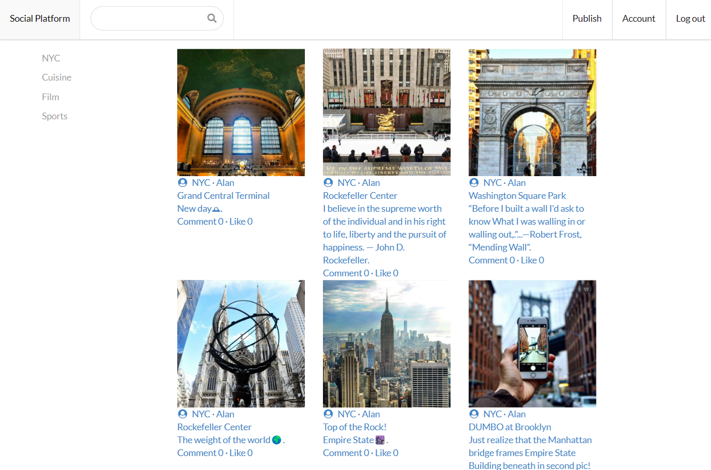

# Social Media Platform



https://nyc-social-platform.web.app/
<!-- https://kai-social-platform.web.app/ -->

NYC social media platform built with React, Firebase, and Semantic UI React.

## Table of Contents

- [Features](#features)
- [Demo](#demo)
- [Getting Started](#getting-started)
  - [Prerequisites](#prerequisites)
  - [Installation](#installation)
- [Usage](#usage)
- [Contributing](#contributing)
- [License](#license)

## Features

- User authentication with Firebase
- Posting and sharing content
- User profiles
- Search functionality
- Responsive design
- and more...

## Demo

You can check out a live demo of the platform at [Demo Link](https://your-demo-link.com).

## Getting Started

### Prerequisites

Before you begin, ensure you have met the following requirements:

- Node.js and npm installed
- Firebase account and project set up
- Algolia account and API keys (for search functionality)

### Installation

1. Clone the repository:

   ```bash
   git clone https://github.com/your-username/social-media-platform.git


# Hosting on Firebase

* Step 1
Download Firebase in terminal
```
npm install -g firebase-tools
```

* Step 2
Open firebase tools

* Step 3
Change directory to the folder of project

* Step 4
Login Firebase
```
firebase login
```

* Step 5
Initialize Firebase
```
firebase init
```

* Step 6
Choose "Hosting: Configure files for Firebase Hosting and (optionally) set up GitHub Action deploys"

* Step 7
Use a existing project (Set up project on Firebase website in advance)

* Step 8
What do you want to use as your public directory? 
Type "build"

* Step 9
Configure as a single-page app (rewrite all urls to /index.html)? 
Select "Y"

* Step 10
  Set up automatic builds and deploys with GitHub? 
Select "No"

* Step 11
Build
```
npm run build
```

* Step 12
Deploy website application
```
firebase deploy
```